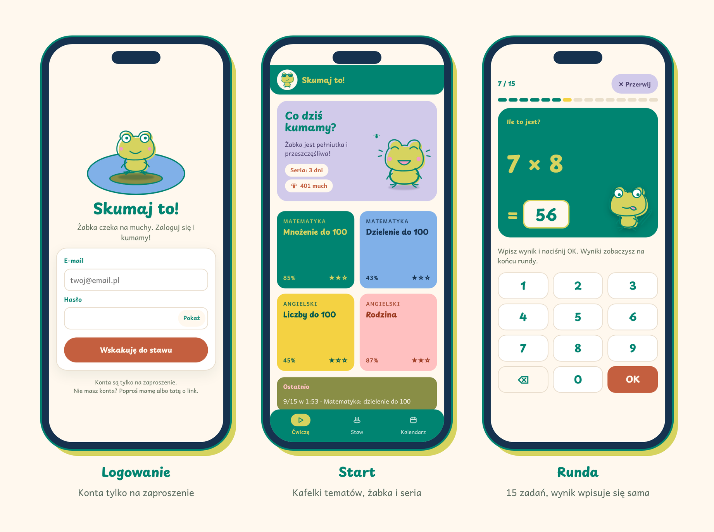
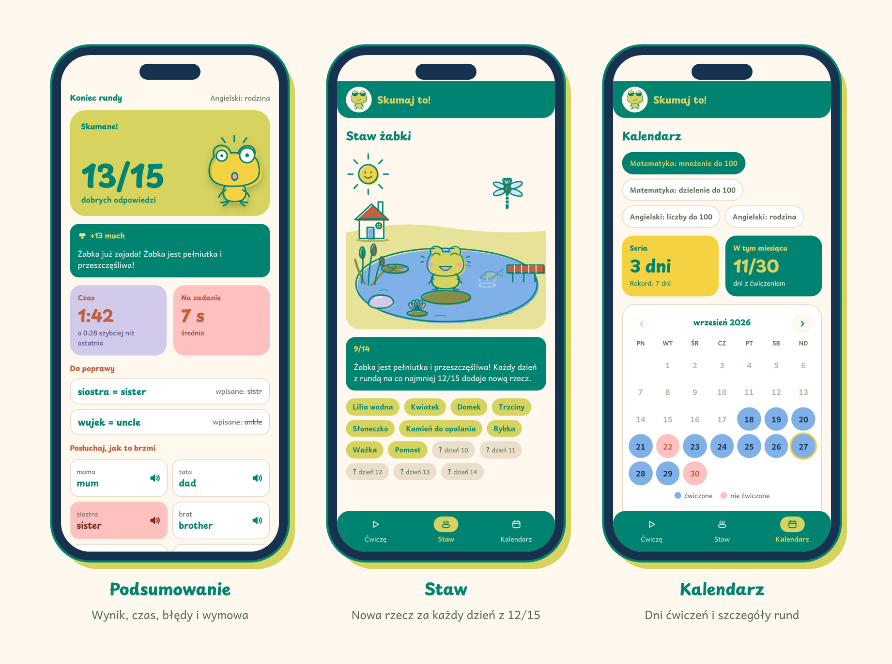
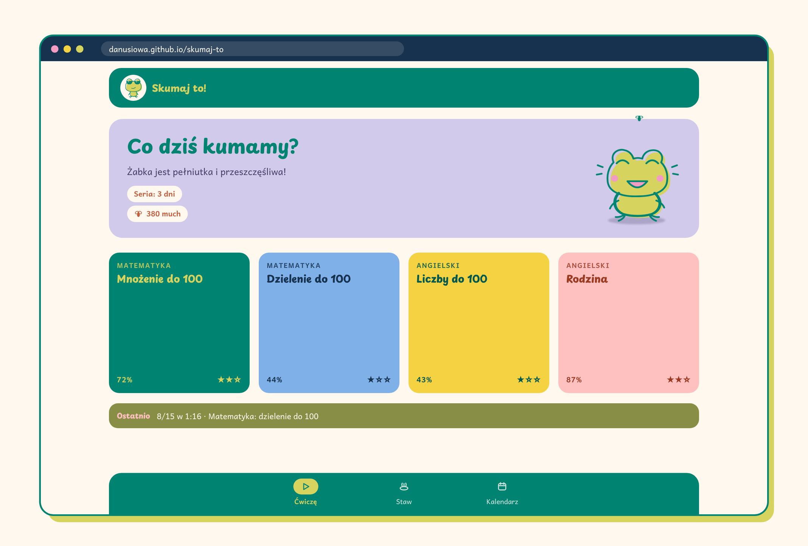
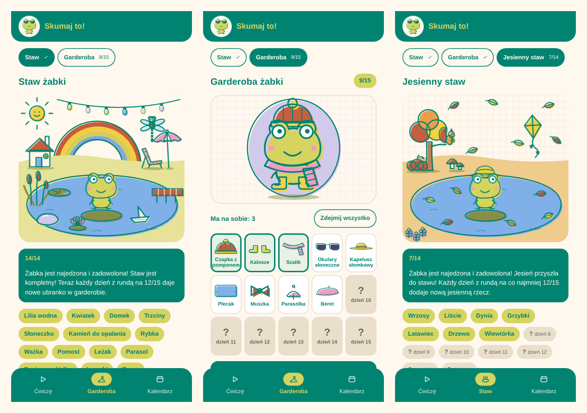

# Skumaj to! 🐸

Apka do powtórek szkolnego materiału dla 4 klasy. Za każdą dobrą odpowiedź żabka dostaje muchę, a za każdy dobry dzień przychodzi nowa nagroda: rzecz do stawu, ubranko albo jesienna niespodzianka.

Powstała na prośbę mojej córki i specjalnie dla niej: żeby powtórki z mnożenia, dzielenia i angielskiego były zabawą. Tematy dochodzą na bieżąco, gdy w szkole pojawia się coś nowego do przećwiczenia.

**Zagraj:** https://danusiowa.github.io/skumaj-to/



## Co jest w środku

- **Rundy po 15 zadań.** Odpowiedź wpisuje się samodzielnie na klawiaturze apki (z cyframi albo z literami), więc klawiatura telefonu nie zasłania ekranu. Dobrze czy źle widać dopiero w podsumowaniu, razem z czasem.
- **Mądre losowanie.** Zadanie nie powtarza się w rundzie (3×7 i 7×3 liczą się jako jedno). Błędne wracają częściej, opanowane rzadziej.
- **Żabka i muchy.** Za każdą dobrą odpowiedź żabka dostaje muchę. Muchy „trawią się” z dnia na dzień, więc bez ćwiczeń żabka chudnie i robi się śpiąca.
- **Nagrody za systematyczność.** Każdy dzień z rundą na co najmniej 12/15 przynosi nagrodę. Najpierw zapełnia się staw, potem garderoba żabki, potem jesienny staw (szczegóły niżej).
- **Kalendarz.** Dla każdego tematu osobno. Widać serię, rekord, a po stuknięciu dnia rundy ze wszystkimi zadaniami.
- **Wymowa i dyktando.** W angielskich słówkach z rodziny po rundzie można odsłuchać wymowę, a w dyktandzie apka sama czyta słowa (głos wbudowany w urządzenie).
- **Skumane.** Opanowany temat można odłożyć do archiwum i w każdej chwili przywrócić.
- **Działa wszędzie:** na telefonie, tablecie i komputerze. Można ją dodać do ekranu głównego jak zwykłą apkę.

## Jak wygląda



Na komputerze i tablecie kafelki układają się szerzej, cztery w rzędzie:



## Nagrody za systematyczność

Nagrodę daje **dzień** z co najmniej jedną rundą na 12/15 albo lepiej (kilka dobrych rund tego samego dnia to nadal jedna nagroda). Dni liczą się po kolei przez wszystkie etapy. Kolejny etap pojawia się dopiero wtedy, gdy poprzedni jest kompletny:

| Etap | Ile nagród | Co się zbiera |
|---|---|---|
| 1. Staw | 14 | Lilia, kwiatek, domek, trzciny, słoneczko, kamień, rybka, ważka, pomost, leżak, parasol, łódka, lampki, tęcza |
| 2. Garderoba | 15 | Czapka z pomponem, kalosze, szalik, okulary słoneczne, kapelusz słomkowy, plecak, muszka, parasolka, beret, trampki, okrągłe okulary, korale, peleryna, czapka kucharza, korona |
| 3. Jesienny staw | 14 | Wrzosy, liście, dynia, grzybki, latawiec, drzewo, wiewiórka, chmurka z deszczykiem, odlatujące ptaki, kasztany, kosz jabłek, jeżyk, łódka z liścia, strach na wróble |

- **Garderoba.** Z zebranych ubranek można w każdej chwili składać strój: stuknięcie zakłada albo zdejmuje rzecz, a „Zdejmij wszystko” rozbiera żabkę. Na każde miejsce (głowa, oczy, szyja, plecy, stopy, łapka) żabka nosi jedną rzecz. Dopóki nic nie zostanie zmienione, żabka nosi najnowsze ubranko na każde miejsce.
- **Gdzie widać strój.** W garderobie i na ekranie startowym. W letnim stawie żabka jest zawsze bez ubranek, a w jesiennym zawsze w żółtym kapeluszu od deszczu.
- **Stare komplety.** Po skończeniu pierwszego etapu nad sceną pojawiają się przyciski etapów (np. „Staw ✓”, „Garderoba 9/15”), więc każdy zebrany komplet można dalej oglądać.
- **Po wszystkim.** Gdy jesienny staw jest kompletny, każdy kolejny dobry dzień dosypuje na trawę liść albo kasztan.
- **Podsumowanie rundy** mówi, co przyszło („Nowe ubranko! Muszka”), a na końcu etapu, co będzie dalej.
- **Zapis stroju.** Strój zapisuje się w telefonie i w Supabase razem z ustawieniami (w kolumnie `archiwum` tabeli `ustawienia`, pod kluczem `_stroj`), więc baza nie potrzebuje zmian.



Na komputerze i tablecie garderoba ma dwie kolumny: żabka po lewej, ubranka po prawej.

### Jak dodać nagrody

W `index.html`:

- rzeczy do letniego stawu są na liście `STAW`, do jesiennego na liście `JESIEN` (rysunek SVG w układzie sceny 360×320, `z` ustala, co jest z przodu, a `anim` dodaje lekki ruch),
- ubranka są na liście `UBRANKA`, a ich rysunki w `<defs>` na początku `<body>` (identyfikatory `ub-…`, w układzie rysunku żabki),
- kolejność etapów ustala lista `ETAPY`. Nowy etap (np. rodzina) to nowa pozycja na tej liście i ekran do niego w funkcji `staw()`.

Kolejność na liście to kolejność odblokowania, więc nowe rzeczy dopisuje się na końcu.

## Tematy

| Przedmiot | Temat |
|---|---|
| Matematyka | Mnożenie do 100 |
| Matematyka | Dzielenie do 100 |
| Matematyka | Dzielenie z resztą do 100 (wynik i reszta w osobnych okienkach) |
| Angielski | Liczby do 100 (słowami) |
| Angielski | Rodzina |
| Angielski | Rodzina ze słuchu (dyktando: apka czyta słowo, wpisuje się, co słychać) |

### Jak dodać nowy temat

Tematy są w `index.html`, na liście `TEMATY`. Nowy temat to jeden obiekt:

```js
{
  id: "ang-kolory",                      // unikalny, nie zmieniać po dodaniu (po nim zapisują się wyniki)
  nazwa: "Angielski: kolory",            // "Przedmiot: temat"
  typ: "tekst",                          // "liczby" = klawiatura z cyframi, "tekst" = klawiatura z literami
  // reszta: true,                      // przy "liczby": dwa okienka, wynik i reszta (odp: "3 r. 2")
  polecenie: "Napisz po angielsku",
  tlo: "#80B0E8", napis: "#16324F",      // kolor kafelka i napisu
  wymowa: "en-GB",                       // opcjonalnie: głośniczki z wymową w podsumowaniu
  zadania(){
    return lista([
      ["czerwony", "red"],
      ["szary", "grey / gray"],          // kilka dobrych odpowiedzi rozdziela ukośnik
    ]);
  }
}
```

Temat potrzebuje co najmniej 15 zadań, żeby runda nie miała powtórek.

## Logowanie i wyniki

- Konta są **tylko na zaproszenie**. Każdy zalogowany może zaprosić nową osobę przyciskiem „Zaproś” w nagłówku, który tworzy jednorazowy link. Link do ustawienia nowego hasła dla istniejącego konta może utworzyć tylko administratorka. Kod jest w części adresu po `#`, więc podgląd linku w WhatsAppie go nie zużyje.
- Wyniki zapisują się same: od razu w telefonie, a w tle w bazie Supabase. Bez internetu czekają i wysyłają się później.
- W bazie każdy widzi tylko swoje wyniki (RLS).

## Budowa

| Plik | Co to jest |
|---|---|
| `index.html` | Cała apka: wygląd, logika i zapis w jednym pliku |
| `manifest.json`, `ikona-*.png` | Ikona i nazwa po dodaniu do ekranu głównego |
| `supabase/migrations/01-wyniki.sql` | Tabele `rundy` i `ustawienia` z zabezpieczeniami |
| `supabase/functions/invite-link/` | Funkcja tworząca linki z zaproszeniem |
| `docs/brief-nowa-apka.md` | Opis mechaniki, gdyby powstawała podobna apka |

Strona jest na GitHub Pages (gałąź `main`, katalog główny). Każda zmiana w `main` trafia na stronę po minucie lub dwóch.

### Konfiguracja Supabase (jednorazowo)

1. Nowy projekt w Supabase (region w Europie).
2. W edytorze SQL uruchomić `supabase/migrations/01-wyniki.sql`.
3. W **Authentication** wyłączyć „Allow new users to sign up” i „Confirm email”, a konto administratorki dodać ręcznie.
4. Wdrożyć funkcję `invite-link` z wyłączonym „Verify JWT with legacy secret”.
5. W `index.html`, w obiekcie `SUPABASE`, wpisać Project URL i klucz **publishable**. Kluczy secret ani service_role nigdy nie wpisuje się do apki.
